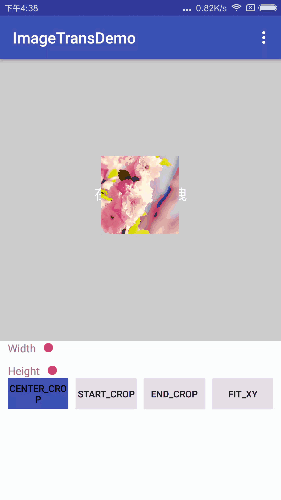

# ImageTrans
简单的封装了一个仿微信的图片查看过渡动画demo </br>
* 1.支持4种裁剪方式（CENTER_CROP、START_CROP、END_CROP、FIT_XY）的缩略图到原图的无缝过渡（支持长图）
* 2.仿照微信的下拉手势关闭图片
##### 具体demo 请下载：[demo.apk](preview/app-debug.apk)</br>
## 预览
根据四种缩略图裁剪方式变形动画



## 使用方法
```
 ImageTrans.with(context)
                     .setImageList(imageList)
                     .setNowIndex(clickPos)
                     .setSourceImageView(new SourceImageViewGet())
                     .setProgressBar(new ProgressViewGet())
                     .setImageLoad(new ImageLoad())
                     .setAdapter(new ImageTransAdapter())
                     .show();
```
### 可选设置
```
setConfig(new ITConfig())
```
|方法|说明|
|:---|:---|
|enableReadMode(boolean)|是否开启阅读模式，针对长图默认适宽显示 |
|largeThumb()| 预览图适宽显示，默认父容器宽度的1/2显示 |
|readModeRule（float）|自定义长图的判断标准，默认视图高度的1.5倍|
|noThumbWhenCached()|当有缓存的时候不显示预览图，直接显示原图 |
|noThumb()|不显示预览图 |

